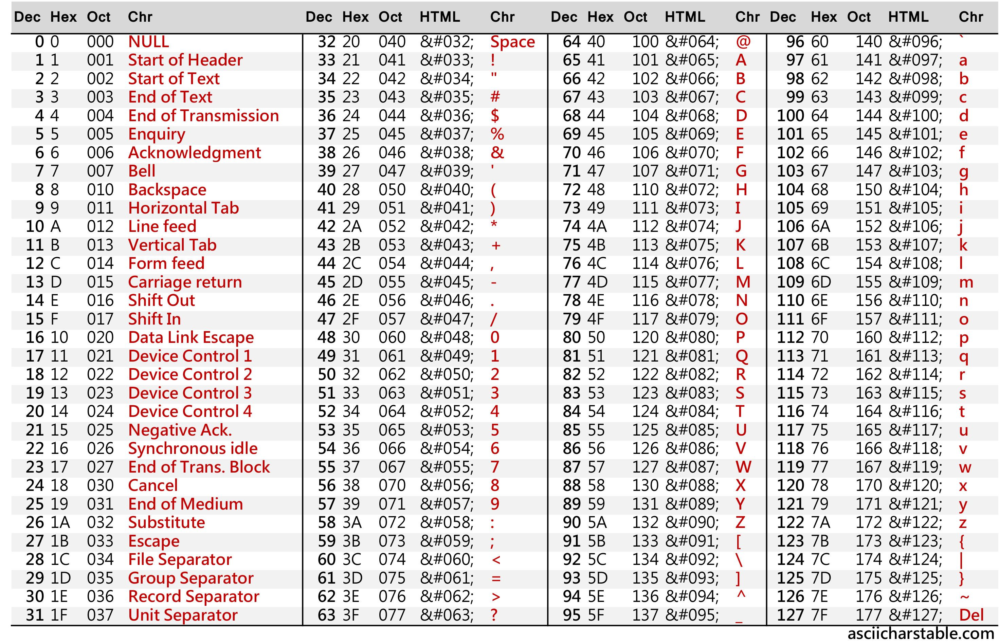

# Basic 6

## Challenge Text

> An encryption system has been set up, which uses an unknown algorithm to change the text given. Requirements: Persistence, some general cryptography knowledge.

> Network Security Sam has encrypted his password. The encryption system is publically available and can be accessed with this form:

## Writeup

For this challenge we're given the password, but it's been encrypted with "an unknown algorithm". We're also given access to the encryption system where we can provide our own inputs and see how it handles them. So a good way to start is by providing some initial test inputs and try to find patterns in the results.

If we try to input the whole alphabet, the encryption process fails. The input is too long. So there's a limit to how many characters we can encrypt.

After trimming the alphabet down until the encryption process works we're left with ```abcdefghijklmn```.

So we're limited to 14 characters which get encrypted to ```acegikmoqsuwy{```

Already, a pattern starts to emerge. The first letter doesn't get encrypted and every letter after the first is higher in the alphabet than its encrypted counterpart.

Next, we can provide the same letter in a repeating pattern to see how it gets encrypted. We'll provide 14 letter a's, which become the first 14 letters of the alphabet.

```aaaaaaaaaaaaaa``` --> ```abcdefghijklmn```

Here we can see that the cipher uses a progressive shift. Each letter is rotated by its position in the string if we start counting at 0.

| **LETTER**   | a | a | a | a | a | a | a | a | a | a | a  | a  | a  | a  |
|--------------|---|---|---|---|---|---|---|---|---|---|----|----|----|----|
| **POSITION** | 0 | 1 | 2 | 3 | 4 | 5 | 6 | 7 | 8 | 9 | 10 | 11 | 12 | 13 |

| **UNENCRYPTED** | **ROTATION** | **ENCRYPTED** |
|:---------------:|:------------:|:-------------:|
| a               | + 0          | a             |
| a               | + 1          | b             |
| a               | + 2          | c             |
| a               | + 3          | d             |
| a               | + 4          | e             |
| a               | + 5          | f             |
| a               | + 6          | g             |
| a               | + 7          | h             |
| a               | + 8          | i             |
| a               | + 9          | j             |
| a               | + 10         | k             |
| a               | + 11         | l             |
| a               | + 12         | m             |
| a               | + 13         | n             |

We almost know enough to start decrypting the password that was given to us. The only missing piece is how the encryption process "adds" or rotates symbols and numbers. We saw above, that when the input was ```abcdefghijklmn``` the encrypted output was ```acegikmoqsuwy{```. The symbol at the end shows us that letters rotated higher than the alphabet don't wrap back around the alphabet but instead will start including symbols.

**Example** - ```zz``` instead of encrypting to ```za``` actually encrypts as ```z{```.

This is because the cipher is wrapping around all [ASCII](https://www.britannica.com/topic/ASCII "Britannica Article On ASCII") printable characters, not just the alphabet.

We can confirm this by looking at an ASCII chart and moving up 1 position from the lowercase letter ```z``` where we'll find ```{```.



We can test this again just to reiterate.

If we provide 4 lowercase letter a's to the encryption algorithm we'll get ```abcd``` because a plus 0 is a, a plus 1 is b, a plus 2 is c, and a plus 3 is d.

But if we provide 4 lowercase letter z's, we'll get ```z{|}``` because z plus 0 is z, z plus 1 is {, z plus 2 is |, z plus 3 is }.

Now that we know the whole encryption process we can start decryption process, which is just the opposite of everything we just did.

Instead of "adding" or rotating forwards we'll take the encrypted password and "subtract" (rotate backwards) through the ASCII chart.

Encrypted Password - ```29;i46?k```

| **CHARACTER** | 2 | 9 | ; | i | 4 | 6 | ? | k |
|---------------|---|---|---|---|---|---|---|---|
| **POSITION**  | 0 | 1 | 2 | 3 | 4 | 5 | 6 | 7 |

| **ENCRYPTED** | **ROTATED** | **UNENCRYPTED** |
|:-------------:|:-----------:|:---------------:|
| 2             | - 0         | 2               |
| 9             | - 1         | 8               |
| ;             | - 2         | 9               |
| i             | - 3         | f               |
| 4             | - 4         | 0               |
| 6             | - 5         | 1               |
| ?             | - 6         | 9               |
| k             | - 7         | d               |

Finally, we have our password decrypted.

```289f019d```